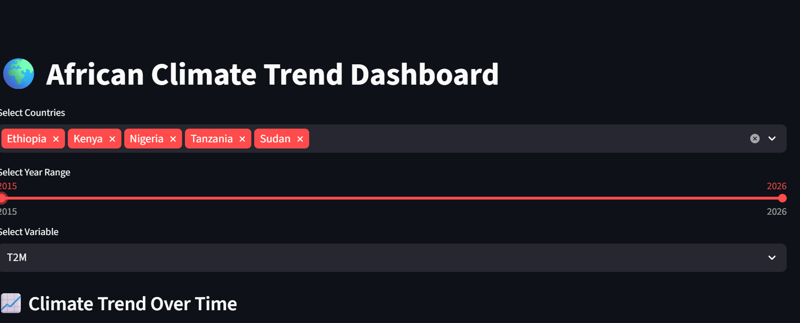

#  African Climate Trend Analysis

Kickstart Your AI Mastery: Week 0 Challenge  
_COP32 Ethiopia — Exploratory and Comparative Climate Data Analysis_

---



---

##  Overview

This project presents an exploratory, comparative, and dashboard-based analysis of historical climate data across Ethiopia, Kenya, Sudan, Tanzania, and Nigeria.  
It is designed as part of the 10 Academy assessment for COP32 preparation, with the goal of surfacing evidence-backed insights for negotiators and policy-makers.

### Key Features

- Exploratory Data Analysis (EDA) per country
- Cross-country trend comparisons and vulnerability ranking
- Interactive [Streamlit](https://streamlit.io/) dashboard (see screenshot above)
- Clean repo structure and CI-friendly code

---

##  Project Structure

```
├── app/                  # Streamlit dashboard code
│   ├── main.py
│   ├── utils.py
│   └── __init__.py
├── data/                 # Data directory (cleaned data stored locally, never pushed)
│   └── combined_clean.csv
├── notebooks/            # Jupyter notebooks for EDA
│   ├── ethiopia_eda.ipynb
│   ├── nigeria_eda.ipynb
│   ├── kenya_eda.ipynb
│   ├── sudan_eda.ipynb
│   ├── tanzania_eda.ipynb
│   └── compare_countries.ipynb
├── dashboard_screenshots/
│   └── your_dashboard_screenshot.png
├── .gitignore
├── requirements.txt
├── README.md
```

---

## ⚙️ Setup Instructions

1. **Clone the repo:**
   ```sh
   git clone https://github.com/<your-username>/climate-challenge-week0.git
   cd climate-challenge-week0
   ```

2. **Create and activate a virtual environment:**
   ```sh
   python -m venv .venv
   source .venv/bin/activate      # On Windows: .venv\Scripts\activate
   ```

3. **Install dependencies:**
   ```sh
   pip install -r requirements.txt
   ```

4. **Obtain the cleaned data:**
   - Place your cleaned CSV in `data/combined_clean.csv`
   - _Note: Data files are not included due to size/privacy restrictions. The format is described in notebooks._

---

## 🏃‍♂️ Usage

### Jupyter Notebooks

1. Launch Jupyter:
   ```sh
   jupyter notebook
   ```
2. Open any EDA notebook in the `notebooks/` directory for per-country or cross-country analysis.

### Streamlit Dashboard

1. From project root:
   ```sh
   streamlit run app/main.py
   ```
2. Interact via:
   - **Country multi-select**: filter chart by country
   - **Year slider**: zoom into specific periods
   - **Variable selector**: temperature, precipitation, humidity
3. _Screenshot of the dashboard:_
   

---

## 📊 Example Dashboard Features

- Line charts: Climate variable trends (T2M, PRECTOTCORR, RH2M) by country/year
- Box plots: Distribution comparisons across countries
- Dynamic summary statistics
- All visualizations fully interactive
- Screenshots stored in `dashboard_screenshots/`

---

## 🛡️ Reproducibility and Data Policy

- The `data/` folder is **gitignored** to prevent accidental commits of datasets.
- All notebook and dashboard scripts work with any compatible input placed in `data/combined_clean.csv`.
- For data format/schema, see the first cell of each `*_eda.ipynb` notebook.
- Data cleaning benchmarks and rationale are documented throughout the notebooks.

---

## 🗂️ Project Highlights

- **Conventional Commits** workflow and meaningful PRs
- CI/CD configuration present (see `.github/workflows/`)
- Well-documented, modular source code
- Reflections and analysis follow the COP/UN negotiation-ready evidence ladder (see Appendix in challenge)

---

## 💡 References

- [WMO State of the Climate in Africa 2024](https://wmo.int/publication-series/state-of-climate-africa-2024)
- [World Bank Climate Risk Country Profiles](https://climateknowledgeportal.worldbank.org/)
- [10 Academy Week 0 Challenge Instructions](<add-link-if-applicable>)

---

## 👤 Author & Contact

- [Eden Nigatu](https://github.com/Eden426/>)

---

## 📑 Appendix

See notebooks for full data cleaning, profiling, and analysis rationale.  
*This README describes all steps needed to reproduce the results.*
